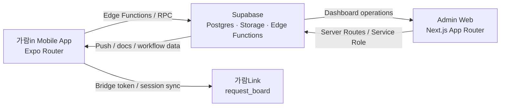

# 가람in FC Onboarding Monorepo

> Last verified: `2026-07-16`
> Control entry: [AGENTS.md](./AGENTS.md)
> Current behavior SSOT: [docs/handbook/INDEX.md](./docs/handbook/INDEX.md)

가람PA지사의 FC 위촉, 온보딩, 운영, 관리자 웹을 함께 관리하는 모노레포입니다.  
사용자 노출 브랜드는 `가람in`이며, 설계의뢰 시스템 `가람Link(request_board)`와 계정, 비밀번호, 세션, 알림을 연동합니다.

## At A Glance

| 항목 | 내용 |
| --- | --- |
| 사용자 브랜드 | `가람in` |
| 저장소 성격 | Expo 모바일 앱 + Next.js 관리자 웹 + Supabase 백엔드 |
| 인증 기준 | Supabase Auth 기본 세션이 아니라 `전화번호 + 비밀번호` + `use-session` |
| 핵심 사용자 | `fc`, `manager`, `admin`, `developer` subtype, request_board-linked `designer` |
| 외부 연동 | `가람Link(request_board)` 브릿지 로그인, 세션 sync, 비밀번호 sync, 앱 푸시 |
| 민감정보 원칙 | 주민번호 평문 비영속 저장, trusted path 조회, 가람in trusted session(`admin`/`manager`/`fc`, `developer`는 admin subtype)과 GaramLink trusted path full-view 허용, FC self-view는 signed 현재 프로필 범위로 제한 |

## Current Snapshot

- 현재 판정은 **릴리스 HOLD**입니다. 최신 전체 영수증 `quality-full-20260716-015916`에서 FC 18/18, 전체 Edge Deno 46/46, root·web TypeScript와 lint/build/test/audit가 통과했습니다. 그러나 원격 caller/migration rollout과 인증 E2E는 아직 증명되지 않았습니다.
- web Node suite의 1개 skip은 실제 Supabase 데이터와 외부 자격증명이 필요한 `referral-graph-realdata`로, `DESTRUCTIVE_OR_EXTERNAL_TEST_BLOCKER`입니다. 로컬 제품 결함이나 원격 E2E PASS로 재분류하지 않습니다.
- credential 상태는 active tracked copy 0, 현재 local untracked copy 6, 과거 tracked 노출 확인입니다. 승인된 로컬 정리와 외부 revoke/rotate·history/clone 평가가 끝날 때까지 HOLD를 유지합니다.
- FC 핵심 흐름은 `회원가입 -> 본인확인 -> 보증 보험 동의 -> 시험 -> 서류 -> 한화 위촉 URL -> 생명/손해 위촉 -> 완료`까지 end-to-end로 구현되어 있습니다.
- FC 가입은 `none / life_only / nonlife_only / both` 커미션 완료 유형을 지원하며, 부분 완료 사용자는 `draft`부터 남은 트랙을 계속 진행합니다.
- `manager`는 앱/웹 전반에서 읽기 전용 역할을 유지합니다.
- `developer`는 앱 권한은 총무와 같지만 표기와 request_board 브릿지 정체성은 별도 처리됩니다.
- request_board-linked 설계매니저는 앱 내부 별도 role을 두지 않고 `fc_profiles / fc_credentials`와 `affiliation='<보험사> 설계매니저'` 패턴으로 관리합니다.
- 현재 앱 DB 기준 request_board-linked 설계매니저 프로필은 `59명`입니다.
- FC/본부장 affiliation이 request_board로 함께 동기화되어, GaramLink 쪽에서는 `소속 · 이름` 기준으로 노출할 수 있습니다.
- request_board password sync는 request_board-backed 계정만 대상으로 유지합니다. `manager`와 `developer` subtype은 `fc` 계열로 sync되고, plain `admin`은 GaramLink direct 계정으로 미러링하지 않습니다.
- `user_presence` 기반 활동 상태와 GaramLink 임베디드 메신저의 optimistic send / unread sync가 반영되어 있습니다.

## Architecture



## Brand And Role Contract

### Brand Names

| 표기 | 의미 | 주의 |
| --- | --- | --- |
| `가람in` | 이 저장소의 앱/운영 시스템 이름 | 회사명/소속명 데이터로 저장하지 않음 |
| `가람Link` | `request_board` 사용자 노출 서비스명 | 이 저장소 내부 브랜드명 아님 |
| `request_board` | 설계의뢰 시스템 기술 저장소명 | 사용자 노출 문구 대체어로 쓰지 않음 |
| `설계요청` | 기능명, 화면명 | 브랜드명으로 저장하지 않음 |

### Roles

| 역할 | 설명 |
| --- | --- |
| `fc` | 본인 온보딩 진행, 설계요청 생성 주체 |
| `manager` | FC 리더, request_board 기준 요청 주체는 FC와 동일, 앱/웹에서는 읽기 전용 |
| `admin` | 총무/운영 담당, 승인·시험·공지·서류·운영 관리 |
| `developer` | `admin_accounts.staff_type='developer'`로 구분되는 총무 하위 유형 |
| `designer` | 보험사 설계 매니저, request_board에서 의뢰 수신/처리 |

## Workflow State

소스 오브 트루스: [`types/fc.ts`](./types/fc.ts)

```ts
'draft'
| 'temp-id-issued'
| 'allowance-pending'
| 'allowance-consented'
| 'docs-requested'
| 'docs-pending'
| 'docs-submitted'
| 'docs-rejected'
| 'docs-approved'
| 'hanwha-commission-review'
| 'hanwha-commission-rejected'
| 'hanwha-commission-approved'
| 'appointment-completed'
| 'final-link-sent'
```

추가 완료 플래그:

```ts
life_commission_completed
nonlife_commission_completed
```

## Repository Map

```text
fc-onboarding-app/
├─ app/                         # Expo Router 화면
├─ components/                  # 공용 모바일 UI
├─ hooks/                       # 세션 / 게이트 / 플랫폼 훅
├─ lib/                         # API / Supabase / request_board 브리지 유틸
├─ types/                       # 공용 타입
├─ web/                         # Next.js 관리자 웹
├─ supabase/
│  ├─ schema.sql
│  ├─ migrations/
│  └─ functions/                # Edge Functions
├─ docs/                        # 운영 / 배포 / 테스트 문서
├─ contracts/                   # API / DB / 컴포넌트 계약
└─ adr/                         # 아키텍처 결정 기록
```

## Quick Start

상세 도구·환경변수·문제 해결은 [개발자 온보딩](./docs/handbook/developer-onboarding.md)을 먼저 봅니다. 아래 명령은 local-only이며 배포나 원격 DB 변경을 포함하지 않습니다.

### 1. Mobile App

```powershell
npm install
npm start
```

### 2. Admin Web

```powershell
Push-Location web
npm install
npm run dev
Pop-Location
```

### 3. Validation

```powershell
git diff --check
node scripts/ci/documentation-governance.test.mjs
node scripts/ci/check-governance.mjs
npm run lint
npx tsc --noEmit
npm test -- --runInBand
```

### 4. Upload-disabled local builds

```powershell
$env:SENTRY_DISABLE_AUTO_UPLOAD = 'true'
$env:SENTRY_DISABLE_UPLOAD = '1'
$env:SENTRY_AUTH_TOKEN = 'local-verification-disabled'
$env:SENTRY_URL = 'http://127.0.0.1:9'

npm run build
Push-Location web
npm run build
Pop-Location
```

Supabase local은 Docker가 실행 중이고 DB가 폐기 가능할 때만 `supabase start`/`supabase status`를 사용합니다. 원격 명령과 배포 절차는 [릴리스·배포 체크리스트](./docs/deployment/DEPLOYMENT.md)의 명시적 승인 경계를 따릅니다.

## Environment Contract

### Root `.env`

```bash
EXPO_PUBLIC_SUPABASE_URL=...
EXPO_PUBLIC_SUPABASE_ANON_KEY=...
EXPO_PUBLIC_REQUEST_BOARD_URL=...
EXPO_PUBLIC_REQUEST_BOARD_API_URL=...
EXPO_PUBLIC_REQUEST_BOARD_WEB_URL=...
EXPO_PUBLIC_REQUEST_BOARD_USE_LOCAL_DEV=1
```

`EXPO_PUBLIC_REQUEST_BOARD_USE_LOCAL_DEV=1`은 Expo 개발 빌드에서만 로컬 Expo host 기준 `request_board` API(`:3001`) / 웹(`:5173`) 자동 해석을 켭니다. 값을 주지 않으면 앱은 운영 GaramLink URL을 사용합니다.

### Admin Web `web/.env.local`

```bash
NEXT_PUBLIC_SUPABASE_URL=...
NEXT_PUBLIC_SUPABASE_ANON_KEY=...
SUPABASE_SERVICE_ROLE_KEY=...
REQUEST_BOARD_NOTIFY_TOKEN=...
NEXT_PUBLIC_WEB_PUSH_VAPID_PUBLIC_KEY=...
WEB_PUSH_VAPID_PRIVATE_KEY=...
WEB_PUSH_SUBJECT=mailto:...
ADMIN_PUSH_SECRET=...
NEXT_PUBLIC_REQUEST_BOARD_URL=...
```

### Sentry Observability

```bash
EXPO_PUBLIC_SENTRY_DSN=...
EXPO_PUBLIC_SENTRY_ENVIRONMENT=production
EXPO_PUBLIC_SENTRY_RELEASE=...
SENTRY_AUTH_TOKEN=...
SENTRY_READ_AUTH_TOKEN=...
SENTRY_ORG=hanhwa-lifelab
SENTRY_PROJECT=react-native
```

- `SENTRY_AUTH_TOKEN`은 Expo/Next release, source-map upload용 secret입니다. Sentry issue/event 조회 fallback으로 사용하지 않습니다.
- Sentry API 조회(organization/project/issue/event/release/artifact)는 `SENTRY_READ_AUTH_TOKEN`만 사용합니다.
- local verification build에서는 `SENTRY_DISABLE_AUTO_UPLOAD=true`, `SENTRY_DISABLE_UPLOAD=1`, 무효 local upload token, loopback `SENTRY_URL`을 함께 설정합니다. Next는 `.env.local`을 다시 읽으므로 shell token을 비우는 것만으로는 차단 증거가 아닙니다.

### Supabase Edge Function Secrets

```bash
SUPABASE_URL=...
SUPABASE_SERVICE_ROLE_KEY=...
REQUEST_BOARD_AUTH_BRIDGE_SECRET=...
FC_APP_SESSION_TOKEN_SECRET=...
FC_APP_SESSION_TOKEN_PREVIOUS_SECRET=...
REQUEST_BOARD_PASSWORD_SYNC_URL=...
REQUEST_BOARD_PASSWORD_SYNC_TOKEN=...
BOARD_AUTOMATION_TOKEN=...
BOARD_AUTOMATION_ACTOR_PHONE=...
BOARD_AUTOMATION_ACTOR_NAME=보험소식 브리핑
ADMIN_WEB_URL=...
ADMIN_PUSH_SECRET=...
```

### Secret Pairing Rules

| 앱 쪽 값 | request_board 쪽 값 | 규칙 |
| --- | --- | --- |
| `REQUEST_BOARD_AUTH_BRIDGE_SECRET` | `FC_ONBOARDING_AUTH_BRIDGE_SECRET` | 반드시 동일 |
| `REQUEST_BOARD_PASSWORD_SYNC_TOKEN` | `FC_ONBOARDING_PASSWORD_SYNC_TOKEN` | 반드시 동일 |
| `REQUEST_BOARD_NOTIFY_TOKEN` | `FC_ONBOARDING_NOTIFY_TOKEN` | 반드시 동일; 누락 시 알림 bridge는 fail closed |

`REQUEST_BOARD_AUTH_BRIDGE_SECRET`은 Request Board bridge-token 호환 경계에만 사용합니다.
FC 앱 세션은 새 토큰을 `FC_APP_SESSION_TOKEN_SECRET`으로만 서명하고, 검증 시에도 해당 current
key와 `FC_APP_SESSION_TOKEN_PREVIOUS_SECRET`만 허용합니다. bridge secret을 app-session fallback으로
재사용하면 bridge secret 보유자가 admin app-session을 위조할 수 있으므로 금지합니다.

`/api/fc-notify`의 Request Board ingress는 `X-Request-Bridge-Token`과
`REQUEST_BOARD_NOTIFY_TOKEN`을 상수 시간 비교한 뒤, 허용된 `request_board_*` 알림만
전달합니다. Request Board sender URL은 정확한 HTTPS `/api/fc-notify`여야 하며 plain
HTTP는 localhost 개발 검증에서만 허용됩니다. title/body는 전체 secret redaction 후
각각 120/2000자로 제한됩니다. 브라우저 ingress는 별도로 request URL의 scheme+Host가
일치하는 same-origin 및 signed server session 검증을 통과해야 하며 body의 role/actor나
`X-Forwarded-Host`를 권한 근거로 사용하지 않습니다. 웹 채팅 caller는 sender identity를
보내거나 `notifications` row를 직접 쓰지 않고, route가 identity를 재구성하며 Edge가
notification persistence의 단일 writer입니다.

### Direct Edge and Board rollout contract (2026-07-12)

- `fc-notify`에서 무인증으로 허용되는 action은 홈 공개 공지용 `latest_notice` 하나뿐입니다.
  내부 서버는 exact service `apikey`, 모바일 앱은 `x-app-session-token`을 사용하며, Edge는
  서명 role/phone/fcId를 활성 DB actor에 다시 결합합니다.
- 17개 `board-*` 함수도 같은 앱 세션과 활성 actor 재검증을 모든 service-role 조회보다 먼저
  수행합니다. body의 `actor`는 구 caller 호환용 claim일 뿐 권한 근거가 아닙니다.
- 모바일 Board 공통 transport는 저장된 앱 세션이 없으면 네트워크 전에 실패합니다. 관리자
  웹은 브라우저에서 Supabase Function을 직접 호출하지 않고 signed same-origin `/api/board`
  proxy와 HttpOnly `web_app_session`을 사용합니다.
- 보험 브리핑은 exact `BOARD_AUTOMATION_TOKEN`과 활성
  `BOARD_AUTOMATION_ACTOR_PHONE`을 요구합니다. 허용 범위는 category/list 조회와
  `general` 카테고리의 `보험소식 브리핑 ...` 생성뿐이며 category 생성, 수정, 삭제, 첨부는
  금지됩니다.
- 인증 축은 signed 모바일/web/runner caller 채택·재로그인 확인 뒤 `fc-notify`와 17개 Board
  Function의 auth enforcement를 수행합니다. body-actor fallback은 두지 않습니다.
- DB 축은 별도입니다. old/new DB 호환 caller 또는 기능 비활성 → additive RPC migration 검증
  → RPC caller 활성화 → 관측 후 compat 제거 순서입니다. 새 `board-update`는 Board migration
  검증 뒤 17개 Board enforcement 창에서, admin-web exam schedule은 Exam migration 검증 뒤
  별도 web release에서 활성화합니다. 이 로컬 변경 세트에서는 배포·secret 설정·DB migration
  적용을 수행하지 않았습니다.

## request_board Integration Points

주요 연동 파일:

- [`supabase/functions/login-with-password`](./supabase/functions/login-with-password)
- [`supabase/functions/set-password`](./supabase/functions/set-password)
- [`supabase/functions/reset-password`](./supabase/functions/reset-password)
- [`supabase/functions/sync-request-board-session`](./supabase/functions/sync-request-board-session)
- [`lib/request-board-api.ts`](./lib/request-board-api.ts)
- [`hooks/use-session.tsx`](./hooks/use-session.tsx)

동작 요약:

- 로그인 시 앱 세션 토큰과 request_board 브릿지 토큰을 함께 발급합니다.
- 세션 복원 시 `sync-request-board-session`으로 GaramLink 세션을 자동 복구합니다.
- 개발 빌드에서 request_board URL env가 비어 있으면 Expo host 기준으로 로컬 API/Web URL을 자동 해석합니다.
- `set-password`와 `reset-password`는 request_board-backed 대상만 `/api/auth/sync-password`로 sync합니다.
- `manager`는 request_board 쪽에서 `fc`로 정규화되고, `developer` subtype도 `fc` mirror만 유지합니다.
- plain `admin`은 request_board direct 계정으로 sync하지 않으며, `set-admin-password`도 더 이상 request_board admin sync를 시도하지 않습니다.

## Implementation Guardrails

- 주민번호 평문을 DB, 로그, 로컬 영속 저장소에 직접 저장하지 않습니다.
- 주민번호 full-view는 trusted server path를 통해 가람in trusted session(`admin`/`manager`/`fc`, `developer`는 admin subtype)과 GaramLink trusted path에 제공하며, FC 자기조회는 signed 현재 프로필 범위로만 허용합니다.
- 관리자 쓰기 경로는 반드시 신뢰 가능한 서버 경로 또는 Edge Function을 거칩니다.
- `manager`에 쓰기 권한을 추가하지 않습니다.
- 스키마 변경 시 `supabase/schema.sql`과 `supabase/migrations/*.sql`를 함께 갱신합니다.
- 모바일 하단 네비게이션은 `resolveBottomNavPreset` / `resolveBottomNavActiveKey`를 통해서만 계산합니다.
- request_board 연동 변경은 앱 코드, Edge Function, 문서를 같은 변경 세트로 맞춥니다.

## References

- 운영 기준: [AGENTS.md](./AGENTS.md)
- handbook: [docs/handbook/INDEX.md](./docs/handbook/INDEX.md)
- 개발자 온보딩: [docs/handbook/developer-onboarding.md](./docs/handbook/developer-onboarding.md)
- 운영 런북: [docs/handbook/operations-runbook.md](./docs/handbook/operations-runbook.md)
- 배포 체크리스트: [docs/deployment/DEPLOYMENT.md](./docs/deployment/DEPLOYMENT.md)
- 명령 안전 등급: [docs/guides/COMMANDS.md](./docs/guides/COMMANDS.md)
- 작업 로그: [.claude/WORK_LOG.md](./.claude/WORK_LOG.md), [.claude/WORK_DETAIL.md](./.claude/WORK_DETAIL.md)
- 문서 인덱스: [docs/README.md](./docs/README.md)
- 계약 문서: [contracts](./contracts)
- 관리자 웹 안내: [web/README.md](./web/README.md)
- 아키텍처 결정 기록: [adr/README.md](./adr/README.md)
