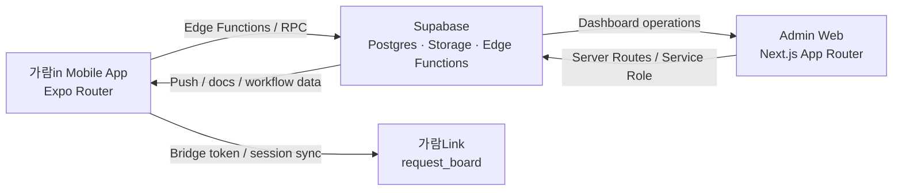

# 가람in FC Onboarding Monorepo

> Last verified: `2026-03-15`  
> Source of truth: [AGENTS.md](./AGENTS.md)

가람PA지사의 FC 위촉, 온보딩, 운영, 관리자 웹을 함께 관리하는 모노레포입니다.  
사용자 노출 브랜드는 `가람in`이며, 설계의뢰 시스템 `가람Link(request_board)`와 계정, 비밀번호, 세션, 알림을 연동합니다.

## At A Glance

| 항목 | 내용 |
| --- | --- |
| 사용자 브랜드 | `가람in` |
| 저장소 성격 | Expo 모바일 앱 + Next.js 관리자 웹 + Supabase 백엔드 |
| 인증 기준 | Supabase Auth 기본 세션이 아니라 `전화번호 + 비밀번호` + `use-session` |
| 핵심 사용자 | `fc`, `manager`, `admin`, `developer` subtype, request_board-linked `designer` |
| 외부 연동 | `가람Link(request_board)` 브릿지 로그인, 세션 sync, 비밀번호 sync, 앱 푸시 |
| 민감정보 원칙 | 주민번호 평문 비저장, 서버 경유 조회, 서비스 롤 기반 접근 |

## Current Snapshot

- FC 핵심 흐름은 `회원가입 -> 본인확인 -> 수당동의 -> 시험 -> 서류 -> 위촉 -> 완료`까지 end-to-end로 구현되어 있습니다.
- FC 가입은 `none / life_only / nonlife_only / both` 커미션 완료 유형을 지원하며, 부분 완료 사용자는 `draft`부터 남은 트랙을 계속 진행합니다.
- `manager`는 앱/웹 전반에서 읽기 전용 역할을 유지합니다.
- `developer`는 앱 권한은 총무와 같지만 표기와 request_board 브릿지 정체성은 별도 처리됩니다.
- request_board-linked 설계매니저는 앱 내부 별도 role을 두지 않고 `fc_profiles / fc_credentials`와 `affiliation='<보험사> 설계매니저'` 패턴으로 관리합니다.
- 현재 앱 DB 기준 request_board-linked 설계매니저 프로필은 `54명`입니다.
- FC/본부장 affiliation이 request_board로 함께 동기화되어, GaramLink 쪽에서는 `소속 · 이름` 기준으로 노출할 수 있습니다.
- `user_presence` 기반 활동 상태와 GaramLink 임베디드 메신저의 optimistic send / unread sync가 반영되어 있습니다.

## Architecture



## Brand And Role Contract

### Brand Names

| 표기 | 의미 | 주의 |
| --- | --- | --- |
| `가람in` | 이 저장소의 앱/운영 시스템 이름 | 회사명/소속명 데이터로 저장하지 않음 |
| `가람Link` | `request_board` 사용자 노출 서비스명 | 이 저장소 내부 브랜드명 아님 |
| `request_board` | 설계의뢰 시스템 기술 저장소명 | 사용자 노출 문구 대체어로 쓰지 않음 |
| `설계요청` | 기능명, 화면명 | 브랜드명으로 저장하지 않음 |

### Roles

| 역할 | 설명 |
| --- | --- |
| `fc` | 본인 온보딩 진행, 설계요청 생성 주체 |
| `manager` | FC 리더, request_board 기준 요청 주체는 FC와 동일, 앱/웹에서는 읽기 전용 |
| `admin` | 총무/운영 담당, 승인·시험·공지·서류·운영 관리 |
| `developer` | `admin_accounts.staff_type='developer'`로 구분되는 총무 하위 유형 |
| `designer` | 보험사 설계 매니저, request_board에서 의뢰 수신/처리 |

## Workflow State

소스 오브 트루스: [`types/fc.ts`](./types/fc.ts)

```ts
'draft'
| 'temp-id-issued'
| 'allowance-pending'
| 'allowance-consented'
| 'docs-requested'
| 'docs-pending'
| 'docs-submitted'
| 'docs-rejected'
| 'docs-approved'
| 'appointment-completed'
| 'final-link-sent'
```

추가 완료 플래그:

```ts
life_commission_completed
nonlife_commission_completed
```

## Repository Map

```text
fc-onboarding-app/
├─ app/                         # Expo Router 화면
├─ components/                  # 공용 모바일 UI
├─ hooks/                       # 세션 / 게이트 / 플랫폼 훅
├─ lib/                         # API / Supabase / request_board 브리지 유틸
├─ types/                       # 공용 타입
├─ web/                         # Next.js 관리자 웹
├─ supabase/
│  ├─ schema.sql
│  ├─ migrations/
│  └─ functions/                # Edge Functions
├─ docs/                        # 운영 / 배포 / 테스트 문서
├─ contracts/                   # API / DB / 컴포넌트 계약
└─ adr/                         # 아키텍처 결정 기록
```

## Quick Start

### 1. Mobile App

```bash
npm install
npm start
npm run android
npm run ios
```

### 2. Admin Web

```bash
cd web
npm install
npm run dev
npm run build
npm run start
```

### 3. Validation

```bash
npm run lint
npm test
npm run test:coverage
npm run qa:init:integrated
npm run qa:validate:integrated
```

### 4. Supabase

```bash
supabase login
supabase link --project-ref <project-ref>
supabase db push
supabase functions deploy login-with-password --project-ref <project-ref>
supabase functions deploy sync-request-board-session --project-ref <project-ref>
```

## Environment Contract

### Root `.env`

```bash
EXPO_PUBLIC_SUPABASE_URL=...
EXPO_PUBLIC_SUPABASE_ANON_KEY=...
EXPO_PUBLIC_REQUEST_BOARD_URL=...
EXPO_PUBLIC_REQUEST_BOARD_API_URL=...
EXPO_PUBLIC_REQUEST_BOARD_WEB_URL=...
```

### Admin Web `web/.env.local`

```bash
NEXT_PUBLIC_SUPABASE_URL=...
NEXT_PUBLIC_SUPABASE_ANON_KEY=...
SUPABASE_SERVICE_ROLE_KEY=...
NEXT_PUBLIC_WEB_PUSH_VAPID_PUBLIC_KEY=...
WEB_PUSH_VAPID_PRIVATE_KEY=...
WEB_PUSH_SUBJECT=mailto:...
ADMIN_PUSH_SECRET=...
NEXT_PUBLIC_REQUEST_BOARD_URL=...
```

### Supabase Edge Function Secrets

```bash
SUPABASE_URL=...
SUPABASE_SERVICE_ROLE_KEY=...
REQUEST_BOARD_AUTH_BRIDGE_SECRET=...
REQUEST_BOARD_PASSWORD_SYNC_URL=...
REQUEST_BOARD_PASSWORD_SYNC_TOKEN=...
ADMIN_WEB_URL=...
ADMIN_PUSH_SECRET=...
```

### Secret Pairing Rules

| 앱 쪽 값 | request_board 쪽 값 | 규칙 |
| --- | --- | --- |
| `REQUEST_BOARD_AUTH_BRIDGE_SECRET` | `FC_ONBOARDING_AUTH_BRIDGE_SECRET` | 반드시 동일 |
| `REQUEST_BOARD_PASSWORD_SYNC_TOKEN` | `FC_ONBOARDING_PASSWORD_SYNC_TOKEN` | 반드시 동일 |

## request_board Integration Points

주요 연동 파일:

- [`supabase/functions/login-with-password`](./supabase/functions/login-with-password)
- [`supabase/functions/set-password`](./supabase/functions/set-password)
- [`supabase/functions/reset-password`](./supabase/functions/reset-password)
- [`supabase/functions/sync-request-board-session`](./supabase/functions/sync-request-board-session)
- [`lib/request-board-api.ts`](./lib/request-board-api.ts)
- [`hooks/use-session.tsx`](./hooks/use-session.tsx)

동작 요약:

- 로그인 시 앱 세션 토큰과 request_board 브릿지 토큰을 함께 발급합니다.
- 세션 복원 시 `sync-request-board-session`으로 GaramLink 세션을 자동 복구합니다.
- 개발 빌드에서 request_board URL env가 비어 있으면 Expo host 기준으로 로컬 API/Web URL을 자동 해석합니다.

## Implementation Guardrails

- 주민번호 평문을 DB, 로그, 클라이언트 payload에 직접 저장하지 않습니다.
- 관리자 쓰기 경로는 반드시 신뢰 가능한 서버 경로 또는 Edge Function을 거칩니다.
- `manager`에 쓰기 권한을 추가하지 않습니다.
- 스키마 변경 시 `supabase/schema.sql`과 `supabase/migrations/*.sql`를 함께 갱신합니다.
- 모바일 하단 네비게이션은 `resolveBottomNavPreset` / `resolveBottomNavActiveKey`를 통해서만 계산합니다.
- request_board 연동 변경은 앱 코드, Edge Function, 문서를 같은 변경 세트로 맞춥니다.

## References

- 운영 기준: [AGENTS.md](./AGENTS.md)
- 작업 로그: [.claude/WORK_LOG.md](./.claude/WORK_LOG.md), [.claude/WORK_DETAIL.md](./.claude/WORK_DETAIL.md)
- 문서 인덱스: [docs/README.md](./docs/README.md)
- 계약 문서: [contracts](./contracts)
- 관리자 웹 안내: [web/README.md](./web/README.md)
- 아키텍처 결정 기록: [adr/README.md](./adr/README.md)
